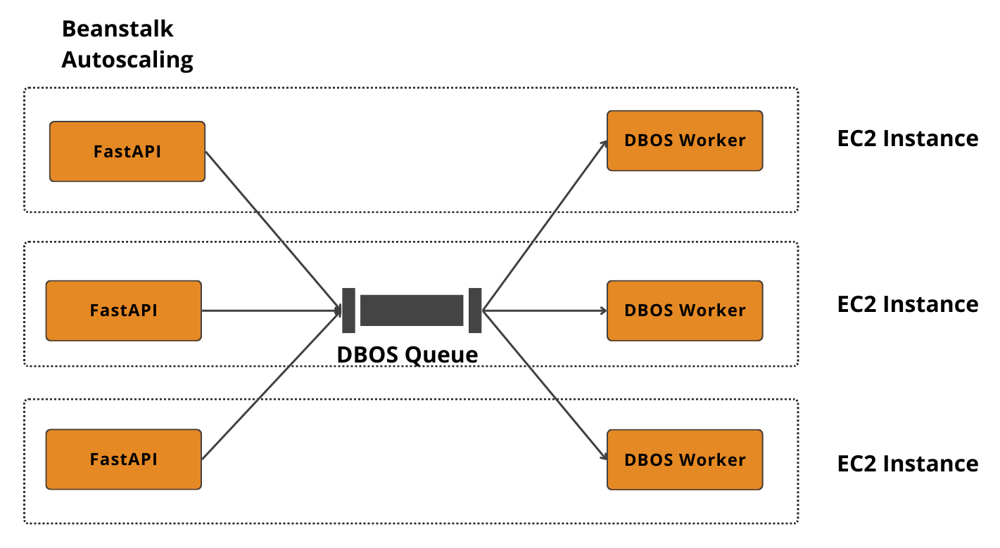

# DBOS Document Ingestion Pipeline

A highly scalable, durable, and reliable multi-document ingestion and Retrieval-Augmented Generation (RAG) system built with **DBOS**, **LlamaIndex**, and **FastAPI**.

## Server Client Endpoint

Run the server.py to start the api endpoint

```
uvicorn ingestion.server:app --reload
```

## DBOS Workers

These workers run on different IDs and ingest documents into the vector database.

[](https://substackcdn.com/image/fetch/$s_!YChX!,f_auto,q_auto:good,fl_progressive:steep/https%3A%2F%2Fsubstack-post-media.s3.amazonaws.com%2Fpublic%2Fimages%2F3b8a97ef-170a-4fcb-b93b-cae610c5fb7d_1421x780.png)

Run the worker.py

```
uv run worker.py
```
